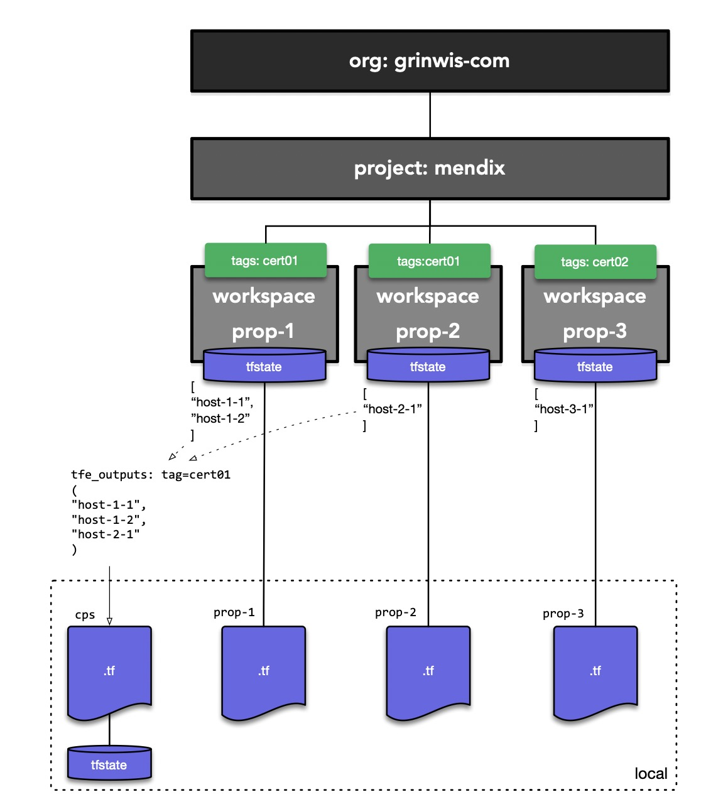

# Akamai Property Management with Terraform Cloud

A Terraform Cloud workspace management system that uses **workspace outputs as the single source of truth** for infrastructure metadata. Multiple environments share data through tag-based workspace discovery, eliminating hardcoded configuration lists and enabling dynamic resource aggregation.

## Core Concept

Instead of maintaining centralized configuration files with lists of hostnames, certificates, or other resources, this architecture:

1. **Each environment manages its own state** in an isolated TFC workspace
2. **Outputs serve as the source of truth** (e.g., which hostnames an environment uses)
3. **Tags enable discovery** - tag workspaces with metadata like `cert:prod-wildcard`
4. **Query by tag to aggregate** - collect all hostnames sharing a certificate across environments

This eliminates configuration drift and ensures each environment is the authoritative source for its own resources.

## Quick Start

### 1. Create Multiple Environments

```bash
# Production API
cp -r environments/example environments/api.prod.acme.com
cd environments/api.prod.acme.com
cat > api.prod.acme.com.auto.tfvars <<EOF
hostnames = ["api.prod.acme.com"]
EOF
cat > .workspace-tags <<EOF
cert:prod-wildcard
EOF
make init && make apply

# Production Web
cd ../
cp -r example www.prod.acme.com
cd www.prod.acme.com
cat > www.prod.acme.com.auto.tfvars <<EOF
hostnames = ["www.prod.acme.com", "prod.acme.com"]
EOF
cat > .workspace-tags <<EOF
cert:prod-wildcard
EOF
make init && make apply

# Staging API
cd ../
cp -r example api.staging.acme.com
cd api.staging.acme.com
cat > api.staging.acme.com.auto.tfvars <<EOF
hostnames = ["api.staging.acme.com"]
EOF
cat > .workspace-tags <<EOF
cert:staging-wildcard
EOF
make init && make apply
```

**Result**: Three TFC workspaces, each with:

- Isolated state
- A `hostnames` output containing its managed hostnames
- Tags indicating which certificate they use

### 2. Query Workspaces by Tag

Now you can query all environments sharing the same certificate:

```bash
cd ../../examples/read-cert-workspaces

# Update main.tf to query for prod certificate
cat > main.tf <<EOF
module "prod_cert_workspaces" {
  source = "../../modules/tfc-workspace-reader"

  organization = "grinwis-com"
  project      = "mendix"
  tag_filter   = "cert:prod-wildcard"
}
EOF

terraform init
terraform apply
```

**Output**:

```hcl
all_hostnames = [
  "api.prod.acme.com",
  "www.prod.acme.com",
  "prod.acme.com"
]

hostnames_by_workspace = {
  "akamai-prop-api.prod.acme.com" = ["api.prod.acme.com"]
  "akamai-prop-www.prod.acme.com" = ["www.prod.acme.com", "prod.acme.com"]
}

workspace_count = 2
```

The single source of truth is the workspace outputs - no manual list maintenance required!

## Use Cases

### Certificate Management

**Problem**: Multiple environments use the same SSL certificate. You need all hostnames for the SAN field.

**Solution**:

1. Tag each environment with `cert:cert-id` in `.workspace-tags`
2. Use `tfc-workspace-reader` to query all workspaces with that tag
3. Aggregate hostnames automatically from workspace outputs
4. Use the list to generate/renew certificates

```hcl
module "prod_cert_hostnames" {
  source       = "../../modules/tfc-workspace-reader"
  organization = "grinwis-com"
  project      = "mendix"
  tag_filter   = "cert:prod-wildcard-2024"
}

# Use aggregated hostnames for certificate
resource "akamai_certificate" "prod_wildcard" {
  sans = module.prod_cert_hostnames.hostnames
}
```

## Architecture

### Terraform Cloud Hierarchy

This project uses Terraform Cloud's organizational structure to manage multiple environments:



**Three-Layer Structure:**

1. **Organization** (`grinwis-com`): Top-level container for all workspaces
2. **Project** (`mendix`): Logical grouping of related workspaces
3. **Workspaces** (one per environment): Isolated state and configuration

**Key Components:**

- **Tags** (green): Used to group workspaces by shared attributes (e.g., `cert:cert01` for certificate grouping)
- **tfstate** (blue): Each workspace maintains its own isolated Terraform state
- **Outputs**: Each workspace exposes data (e.g., `hostnames`) that can be queried by other workspaces

**Tag-Based Discovery:**

The `tfc-workspace-reader` module queries workspaces by tag (e.g., `cert:cert01`) and aggregates their outputs. This allows certificate managers, DNS configurations, or compliance tools to automatically discover all environments sharing a tag without maintaining manual lists.

**Local Development:**

Each environment directory (e.g., `environments/prop-1/`) contains `.tf` files that deploy to their corresponding TFC workspace. The workspace name is automatically derived from the directory name.

### Directory Structure

```
.
├── environments/          # Environment-specific configs
│   ├── example/          # Template environment
│   ├── api.prod.acme.com/    # Production API workspace
│   └── www.prod.acme.com/    # Production Web workspace
├── modules/
│   ├── akamai-property/      # Akamai resource module
│   └── tfc-workspace-reader/ # Query workspaces by tag
├── examples/
│   └── read-cert-workspaces/ # Example: aggregate hostnames by cert tag
└── scripts/
    ├── init-tfc-workspace.sh   # Workspace creation automation
    └── delete-tfc-workspace.sh # Workspace deletion automation
```

### How It Works

```
┌─────────────────────────────────────────────────────────┐
│  Environment: api.prod.acme.com                         │
│  TFC Workspace: akamai-prop-api.prod.acme.com           │
│  Tags: cert:prod-wildcard, environment:api.prod.acme.com│
│  Outputs: hostnames = ["api.prod.acme.com"]             │
└─────────────────────────────────────────────────────────┘
                            │
                            │ Tagged with
                            │ cert:prod-wildcard
                            ▼
┌─────────────────────────────────────────────────────────┐
│  Environment: www.prod.acme.com                         │
│  TFC Workspace: akamai-prop-www.prod.acme.com           │
│  Tags: cert:prod-wildcard, environment:www.prod.acme.com│
│  Outputs: hostnames = ["www.prod.acme.com"]             │
└─────────────────────────────────────────────────────────┘
                            │
                            │
                            ▼
┌─────────────────────────────────────────────────────────┐
│  Query Module: tfc-workspace-reader                     │
│  Filter: tag_filter = "cert:prod-wildcard"              │
│                                                          │
│  Discovers both workspaces above                        │
│  Reads their outputs                                    │
│  Aggregates: ["api.prod.acme.com", "www.prod.acme.com"] │
└─────────────────────────────────────────────────────────┘
```

## Environment Management

### Creating an Environment

Each environment is a directory under `environments/` with its own TFC workspace:

```bash
cd environments
cp -r example my-new-env
cd my-new-env

# Configure variables
cat > my-new-env.auto.tfvars <<EOF
hostnames = ["app.example.com", "api.example.com"]
EOF

# Add tags for discovery
cat > .workspace-tags <<EOF
cert:my-certificate
team:platform
cost-center:engineering
EOF

# Initialize workspace in TFC
make init

# Deploy
make plan
make apply
```

**What happens**:

1. Workspace `akamai-prop-my-new-env` created in TFC with auto-apply enabled
2. Tags applied: `environment:my-new-env`, `project:mendix`, `cert:my-certificate`, `team:platform`, `cost-center:engineering`
3. Workspace output `hostnames` becomes queryable by other modules

### Workspace Auto-Configuration

The `make init` command:

- Detects workspace name from directory: `environments/api.test.nl` → `akamai-prop-api.test.nl`
- Updates `backend.tf` automatically if name doesn't match
- Creates workspace in TFC if missing (or updates existing workspace)
- Enables auto-apply on the workspace (no manual approval needed)
- Sets working directory to `environments/<dir-name>` (enables `../../modules` references)
- Applies tags from `.workspace-tags` file
- Runs `terraform init`

No manual workspace configuration needed!

## Tag-Based Workspace Discovery

### The Single Source of Truth Pattern

**Traditional Approach** (configuration drift risk):

```hcl
# Centralized list - easily gets out of sync
variable "prod_certificate_hostnames" {
  default = [
    "api.prod.acme.com",   # Is this still deployed?
    "www.prod.acme.com",   # Did someone remove this?
    "old.prod.acme.com",   # Still needed?
  ]
}
```

**This Architecture** (always accurate):

```hcl
# Query live workspaces - always reflects current state
module "prod_hostnames" {
  source     = "../../modules/tfc-workspace-reader"
  tag_filter = "cert:prod-wildcard"
}

# hostnames come from actual deployed environments
# If environment is destroyed, it's automatically removed from the list
# If new environment is added with the tag, it's automatically included
```

### Common Tag Patterns

```bash
# Certificate grouping
cert:wildcard-acme-com
cert:specific-hostname

# Environment type
environment-type:production
environment-type:staging
environment-type:development

# Team ownership
team:platform
team:data
owner:john@example.com

# Criticality
critical:true
sla:99.9

# Cost tracking
cost-center:engineering
department:product
```

## Examples

### Example 1: Certificate Renewal Workflow

You have 10 production environments using the same wildcard certificate:

```bash
# Tag all environments during creation
cd environments/api-prod
echo "cert:prod-wildcard-2024" >> .workspace-tags
make init && make apply

cd ../web-prod
echo "cert:prod-wildcard-2024" >> .workspace-tags
make init && make apply

# ... (8 more environments)
```

When it's time to renew the certificate:

```hcl
# certificate-manager/main.tf
module "prod_cert_hosts" {
  source     = "../modules/tfc-workspace-reader"
  tag_filter = "cert:prod-wildcard-2024"
}

resource "akamai_certificate" "prod_wildcard_2024" {
  sans = module.prod_cert_hosts.hostnames
  # Automatically includes all 10 environments' hostnames
  # No manual list maintenance!
}
```

### Example 2: Team-Based Resource Management

Find all resources owned by the platform team:

```bash
cd examples/read-cert-workspaces
cat > main.tf <<EOF
module "platform_team_workspaces" {
  source     = "../../modules/tfc-workspace-reader"
  tag_filter = "team:platform"
}

output "platform_team_resources" {
  value = {
    workspaces = module.platform_team_workspaces.workspace_names
    hostnames  = module.platform_team_workspaces.hostnames
    count      = module.platform_team_workspaces.workspace_count
  }
}
EOF

terraform apply
```

## Requirements

### Prerequisites

- **Terraform** >= 1.5
- **Terraform Cloud Account** (free tier available)

### Terraform Cloud Setup

If you don't have a Terraform Cloud account yet:

1. **Create an account**: Sign up at [https://app.terraform.io/signup/account](https://app.terraform.io/signup/account)
2. **Create an organization**:
   - After signing up, you'll be prompted to create an organization
   - Choose a unique organization name (e.g., `your-company-name`)
   - This will replace `grinwis-com` in the configuration files
3. **Create a project** (optional but recommended):
   - In your organization, navigate to Projects
   - Create a new project (e.g., `infrastructure` or `akamai`)
   - This will replace `mendix` in the configuration files
4. **Authenticate locally**:
   ```bash
   terraform login
   # Or set environment variable
   export TFC_TOKEN="your-token-here"
   ```

### Configuration

Update these values in your environment's `backend.tf` files:

- **Organization**: Replace `grinwis-com` with your organization name
- **Project**: Replace `mendix` with your project name (or remove if not using projects)

## Commands

From any environment directory:

```bash
make init        # Run validations, create/configure TFC workspace and initialize
make plan        # Preview infrastructure changes
make apply       # Apply changes
make destroy     # Destroy infrastructure resources only
make destroy-all # Destroy resources AND delete TFC workspace
make fmt         # Format Terraform files
make fmt-check   # Check if files are properly formatted
make validate    # Validate Terraform configuration
make lint        # Run tflint (requires tflint installed)
make help        # Show available commands
```

**Note**: `make init` automatically runs `fmt-check`, `lint`, and `validate`. Validation failures will prevent initialization.

From repository root (validate all modules/environments):

```bash
make fmt          # Format all Terraform files
make fmt-check    # Check all formatting
make validate-all # Validate all modules and examples
make lint         # Lint all directories
make pre-commit   # Run all checks (useful for CI/CD)
```

## Additional Documentation

- **[environments/README.md](environments/README.md)** - Detailed environment creation guide
- **[docs/TAGGING.md](docs/TAGGING.md)** - Comprehensive tagging documentation
- **[docs/VALIDATION.md](docs/VALIDATION.md)** - Code validation and formatting guide
- **[modules/akamai-property/README.md](modules/akamai-property/README.md)** - Akamai property module
- **[modules/tfc-workspace-reader/README.md](modules/tfc-workspace-reader/README.md)** - Workspace reader module
- **[CLAUDE.md](CLAUDE.md)** - Architecture and development guidance

## Benefits of This Architecture

1. **No Configuration Drift**: Workspace outputs are always current
2. **Decentralized Management**: Each environment owns its configuration
3. **Automatic Discovery**: New environments auto-join groups via tags
4. **Clean Removal**: Destroyed environments auto-removed from aggregations
5. **Flexible Querying**: Query by any tag (cert, team, environment-type, etc.)
6. **Audit Trail**: TFC tracks all changes to each workspace
7. **Isolated State**: Each environment has independent state - no blast radius

## Example Workflow: Adding a New Production Service

```bash
# 1. Create new environment
cd environments
cp -r example checkout.prod.acme.com
cd checkout.prod.acme.com

# 2. Configure
cat > checkout.prod.acme.com.auto.tfvars <<EOF
hostnames = ["checkout.prod.acme.com"]
EOF

cat > .workspace-tags <<EOF
cert:prod-wildcard-2024
team:payments
critical:true
environment-type:production
EOF

# 3. Deploy
make init
make apply

# 4. The service is now automatically included in:
#    - Certificate renewals (cert:prod-wildcard-2024)
#    - Team dashboards (team:payments)
#    - Critical alerts (critical:true)
#    - Production monitoring (environment-type:production)
```

No manual updates to centralized lists required - tags make it discoverable!

## License

[Your License Here]
